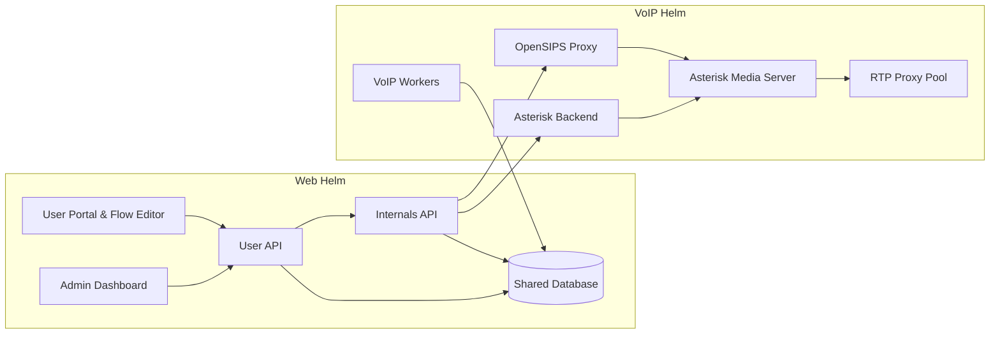

# Lineblocs

Lineblocs is a modular, open communications platform designed for telecom operators, UCaaS providers, and enterprises who want to build white-label Voice, WebRTC, and messaging services. It separates business logic from real-time voice infrastructure while offering developer-centric APIs, SDKs, and deployment flexibility.

---

## Architecture Overview

Lineblocs is split into two core Helm charts:

- **Web Helm Chart**: handles user-facing portals, admin dashboard, APIs, business logic  
- **VoIP Helm Chart**: handles SIP signaling, media servers, call control, and billing  

They share a **central database** and communicate via APIs for user operations and real-time communication logic.  
This separation allows the Web stack and VoIP stack to scale independently while remaining tightly integrated.

### Architecture Diagram

