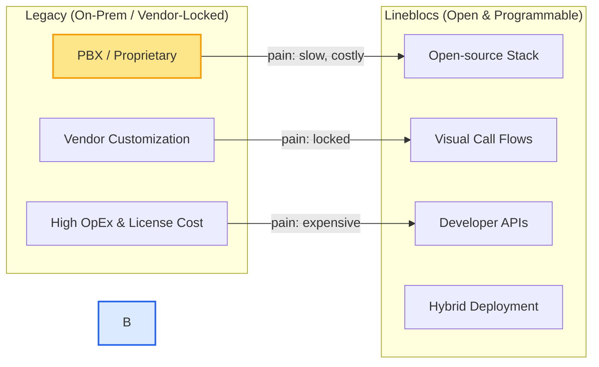
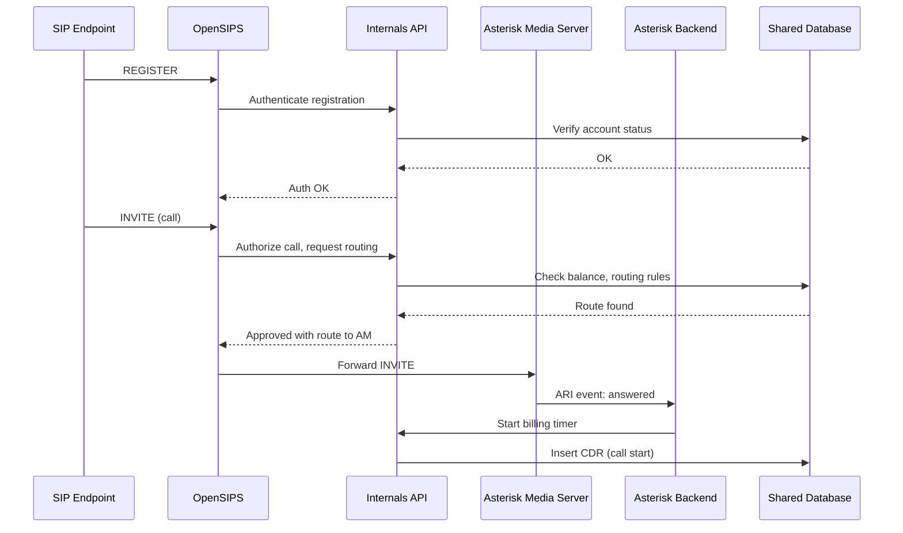

# Lineblocs

<p align="center">
  
</p>

<p align="center">
  <strong>Open-source cloud communications platform for building, hosting, and scaling modern VoIP solutions.</strong>
</p>

<p align="center">
  <a href="https://lineblocs.com/resources">Documentation</a> •
  <a href="https://lineblocs.com">Website</a> •
  <a href="https://github.com/lineblocs">GitHub</a>
</p>

---

## 📁 Table of Contents

- [What Can I Do with Lineblocs?](#what-can-i-do-with-lineblocs)  
- [Quickstart (Local Setup)](#quickstart-local-setup)  
- [Cloud Deployment](#cloud-deployment)  
- [Hosted Sandbox (No Setup Required)](#hosted-sandbox-no-setup-required)  
- [Why Lineblocs?](#why-lineblocs)  
- [Architectural Overview](#architectural-overview)  
- [Our Vision](#our-vision)  
- [Community & Contributions](#community--contributions)  
- [Feature Requests & Bugs](#feature-requests--bugs)  
- [Versioning](#versioning)  
- [License](#license)  
- [Team Behind Lineblocs](#team-behind-lineblocs)

---

## What Can I Do with Lineblocs?

Lineblocs provides the core building blocks for modern telephony and real-time communications:

- **Design and run programmable telephony** (SIP, WebRTC, RTP) with a visual Flow Editor.  
- **Manage customers, tenants and billing** through user and admin portals.  
- **Host voice features**: IVR, call recording, conferencing, bridging, number handling.  
- **Integrate voice into apps** using REST APIs and webhooks.  
- **Process billing & CDR pipelines** and generate invoices or usage reports.  
- **Operate at carrier scale** using SIP proxies and RTP proxy pools (architected for scale).  

---

## Quickstart (Local Setup)

> This local quickstart is intended for evaluation and development. For production and cloud deployments, see the Cloud Deployment section and official docs.

```bash
# Clone the main Lineblocs repository (public repo)
git clone https://github.com/lineblocs/lineblocs.git
cd lineblocs

# Bring up a local development environment (Docker Compose)
docker-compose up --build
```

* Once services start, the local ports typically map to:

  * **User Portal**: `http://localhost:3000`
  * **Admin Panel**: `http://localhost:8080/admin`
  * **APIs**: `http://localhost:8000`
  * **SIP** for testing (softphone): `sip:localhost`

> If you do not see these endpoints, consult the `docker-compose.yml` file in the repository for exact port mappings and the `README` in that repo for environment variables.

---

## Cloud Deployment

Lineblocs supports multiple deployment models so organizations can choose what best fits their operational and compliance needs:

* **Self-hosted (Full Web + VoIP)** — host the complete stack in your own cloud or private data center.  
* **Web-only** — run the user/admin stack while leveraging hosted telephony services.  
* **VoIP-only** — run telephony infra and use hosted portals or integrate with other admin systems.  
* **Hybrid** — combine cloud-hosted components with self-hosted media or control-plane pieces to meet data residency, latency, or regulatory requirements.  

For cloud deployment patterns, capacity planning, and recommended architecture for production, consult the official deployment resources:  

[https://lineblocs.com/resources](https://lineblocs.com/resources)

> Note: This README focuses on **service design and architecture** rather than specific orchestration instructions. See the docs above for Helm/Kubernetes manifests and platform-specific deployment guides.

---

## Hosted Sandbox (No Setup Required)

If you want to evaluate Lineblocs without installing anything, check the official resources page for sandbox or demo access (availability may vary):  
👉 [https://lineblocs.com/resources](https://lineblocs.com/resources)

---

## Why Lineblocs?

Telecommunications is transitioning from closed, inflexible systems to programmable, cloud-native platforms — and yet many organizations are still forced to adopt vendor-locked PBX/CPaaS solutions that are costly and hard to customize. Lineblocs is built to address the core pain points enterprises and providers face:

### 1) Open and Extensible
Lineblocs is an **open-source platform**. You have full visibility and control over the stack — from SIP routing to billing pipelines — enabling customization and extension without vendor constraints.

### 2) End-to-end Communications Platform
Rather than stitching together disparate tools, Lineblocs provides an integrated toolkit:
- User and admin portals for operations  
- Visual call-flow orchestration  
- SIP/WebRTC signaling and media processing  
- Billing / CDR pipelines and integrations  
- Developer-friendly APIs and webhooks  

This integration reduces operational friction and shortens time-to-market for communications features.

### 3) Real-time Decisioning with Internals API
A core differentiator is the **Internals API** — a low-latency, high-throughput service used by SIP proxies and media backends to make real-time routing, permission, and billing decisions. It allows sophisticated call flows and accurate usage accounting with minimal latency impact.

### 4) Architected for Scale
Lineblocs applies proven telecom patterns:
- SIP proxies (OpenSIPS) for registration and routing at scale  
- RTP proxy pools to offload media relay and reduce media server load  
- Media engines (Asterisk) for B2BUA tasks like IVR, conferencing, and recording  

These enable predictable scaling from pilot to carrier-grade deployments.

### 5) Programmability and Developer Productivity
Lineblocs is designed for developers:
- **Flow Editor** for visually composing call logic  
- **REST APIs** for programmatic control and integrations  
- **Webhooks** for event-driven workflows and CRM/ERP connectivity  

You can build advanced voice features quickly using tools developers already understand.

### 6) Deployment Flexibility & Data Control
Lineblocs supports self-hosted and hybrid models — useful when data residency, compliance, or latency requirements prohibit using hosted-only solutions. You retain full control over data, routing policies, and vendor selection for carriers/trunks.

---

### Old Telecom vs Lineblocs — Visual Comparison



---

## Architectural Overview

Below is a detailed service-level design for Lineblocs. This is intentionally **platform-focused**, describing components and how they interact at runtime.


### Component Details (Service Design)

#### Web Layer
- **User Portal**: SPA providing account management, call history, billing, and self-service features. Uses the **User API** for dynamic operations.  
- **Flow Editor**: Visual drag-and-drop designer used to author call flow graphs and publish executable routing rules. Saves flow configuration to the **Shared Database** via the User API.  
- **Laravel Admin Panel**: Admin UI for managing tenants, carriers, SIP trunk credentials, billing rules, system health, and analytics. It typically reads/writes data directly to the shared datastore (subject to role-based access control).  
- **User API**: Public-facing HTTP API that performs validation, auth (API keys / tokens), CRUD, and orchestrates non-real-time operations.  

#### Internals API
- **Purpose**: Private API (machine-to-machine) used by SIP and media components for **low-latency** lookups and writes.  
- **Responsibilities**:  
  * Validate call permissions and user/tenant balance  
  * Compute routing (which trunk, which media cluster)  
  * Emit and record billing events (start/stop)  
  * Provide real-time feature flags and call flow decisions  
- **Design goals**: minimal latency; high throughput; small response sizes; horizontal scaling.  

#### VoIP Layer
- **OpenSIPS Proxy**: Accepts REGISTER and INVITE messages, performs account lookup, enforces routing policies, and forwards signaling to media servers. For each incoming call, it queries the Internals API for authorization and final routing decisions. It also orchestrates RTP Proxy assignment for optimal media paths.  
- **Asterisk Backend (ARI client)**: An application-layer service that listens to Asterisk events via ARI. On call events (answered, bridge, DTMF), it executes business logic — often by calling Internals API endpoints to start/stop billing timers or update CDRs.  
- **Asterisk Media Server**: Acts as a B2BUA for scenarios that need media manipulation (IVR prompts, bridging, recording). Receives SIP from OpenSIPS and is controlled via ARI by the Asterisk Backend.  
- **RTP Proxy Pool**: Stateless or semi-stateless media relays that handle RTP forwarding to avoid NAT/media issues and to distribute load.  
- **VoIP Workers / Billing Enrichers**: Background workers that process raw CDRs, perform rate lookups, apply discounts/promotions, and generate invoices or settlements.  

### Runtime Call Flow (Simplified)



---

## Our Vision

We believe telecommunications should be **open, programmable, and accessible**. Lineblocs exists to:
- Remove vendor lock-in and enable rapid telecom innovation.  
- Make carrier-grade telephony available to product teams and developers.  
- Provide a secure, extensible, and production-ready platform that integrates with modern cloud-native tooling.  

---

## Community & Contributions

We welcome contributions from operators, developers, and system engineers.

- Read our contribution guidelines: `CONTRIBUTING.md` (in-repo).  
- Report issues: [https://github.com/lineblocs/lineblocs/issues](https://github.com/lineblocs/lineblocs/issues)  
- For roadmap, integrations, or enterprise discussions, use the contact options on [https://lineblocs.com](https://lineblocs.com)  

---

## Feature Requests & Bugs

- **Feature requests**: Open a “Feature Request” issue describing the use case, desired behaviour, and potential impact.  
- **Bug reports**: Provide reproduction steps, environment details, and logs where possible.  
- **Security issues**: Contact the Lineblocs team privately (see website for secure disclosure instructions).  

---

## Versioning

Lineblocs follows semantic versioning:

```
MAJOR.MINOR.PATCH
```

- MAJOR for incompatible API changes  
- MINOR for new, backwards-compatible features  
- PATCH for bug fixes and small improvements  

---

## License

Lineblocs is released under **AGPL-3.0**. See `LICENSE` for full terms.

---

## Team Behind Lineblocs

Lineblocs is developed and maintained by the Lineblocs engineering team with contributions from the community. For partnership or enterprise enquiries, visit [https://lineblocs.com](https://lineblocs.com).
