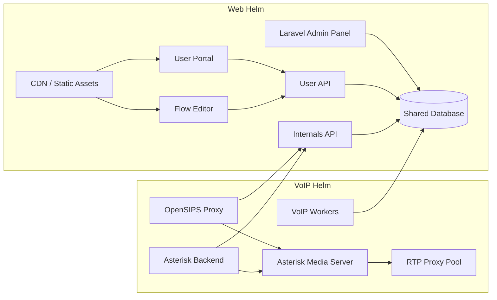

# Lineblocs

[]()
[]()

Lineblocs is a modular, open communications platform designed for telecom operators, UCaaS providers, and enterprises who want to build white-label Voice, WebRTC, and messaging services.  
It separates business logic from real-time voice infrastructure while offering developer-centric APIs, SDKs, and flexible deployment options.

---

## Service Architecture

The Lineblocs service architecture is divided into two primary deployment groups, each managed by separate Helm charts:

- **Web Helm Chart**: User-facing portals, APIs, and administrative tools  
- **VoIP Helm Chart**: SIP signaling, media servers, and call control  

These groups are tightly coupled through shared infrastructure:

- **Shared Database** → single source of truth for accounts, call records, billing, and routing rules  
- **Two distinct APIs** →  
	- **User API**: User or admin-facing business logic  
	- **Internals API**: Low-latency, real-time API for VoIP services  

This separation of concerns allows the **real-time communication systems (VoIP)** to operate independently from the **user-facing web applications** and management tools.

---

### Web Helm Chart Components

- **User Portal (JS App)**  
	SPA for customers to manage accounts, call history, billing, and settings.  
	Assets are served via **CDN** and all dynamic data is retrieved from the **User API**.  

- **Flow Editor (JS App)**  
	Drag-and-drop visual editor for creating and managing call flows.  
	Served via **CDN** and integrates with **User API** for saving and validation.  

- **Laravel Admin Panel**  
	Comprehensive backend portal for administrators to manage users, carriers, VoIP servers, billing, and system analytics.  
	Directly interacts with the **Shared Database** for configuration and data.  

- **User API**  
	Public-facing API gateway handling user and admin actions.  
	Supports authentication, account CRUD, call flow management, and CDR retrieval.  

- **Internals API**  
	Private, high-throughput API for machine-to-machine communication.  
	Handles call authorization, routing instructions, and billing events.  
	Consumed by **OpenSIPS Proxy**, **Asterisk Backend**, and **VoIP Workers**.  

- **Shared Database**  
	Central datastore holding users, routing rules, call flows, billing data, and system settings.  

- **CDN / Static Assets**  
	Delivers compiled JS/CSS/HTML for global low-latency access.  

---

### VoIP Helm Chart Components

- **OpenSIPS Proxy**  
	High-performance SIP proxy for registrations, INVITEs, and message routing.  
	First point of contact for SIP endpoints; queries **Internals API** for authentication and routing.  

- **Asterisk Backend (ARI Client)**  
	Handles in-call control logic.  
	Connects to Asterisk Media Server via ARI WebSocket and triggers **Internals API** for billing and event processing.  

- **Asterisk Media Server**  
	Media engine (IVRs, conferencing, call recording) operating as a B2BUA.  
	Receives SIP from OpenSIPS and executes commands from the Asterisk Backend.  

- **RTP Proxy Pool**  
	Cluster of media relay servers that handle RTP streams between endpoints and media servers.  
	Managed by the **OpenSIPS Proxy**.  

- **VoIP Workers / Billing Enrichers**  
	Asynchronous background tasks: billing enrichment, rate lookups, invoicing, and cleanup.  
	Poll the **Shared Database** and communicate with **Internals API** when needed.  

---

### Architecture Diagram



---

## Quickstart

Deploy the full Lineblocs stack (Web + VoIP) on Kubernetes using Helm:

```bash
# Add Lineblocs Helm repository
helm repo add lineblocs https://helm.lineblocs.com/

# Update repo
helm repo update

# Install Lineblocs stack (Web + VoIP)
helm install lineblocs lineblocs/lineblocs \
	--namespace lineblocs-system \
	--create-namespace \
	-f values.yaml
```

---

## Deployment Modes

| Mode              | Description                                         |
|-------------------|-----------------------------------------------------|
| Full (Web + VoIP) | Self-hosted complete stack in Kubernetes            |
| Web-only          | Host user/admin logic; use Lineblocs cloud for telephony |
| VoIP-only         | Use your own SIP/media stack; manage via Lineblocs cloud |
| Hybrid            | Combine cloud and self-hosted components            |

## Documentation

For complete tutorials, deployment guides, and resources, visit: https://lineblocs.com/resources